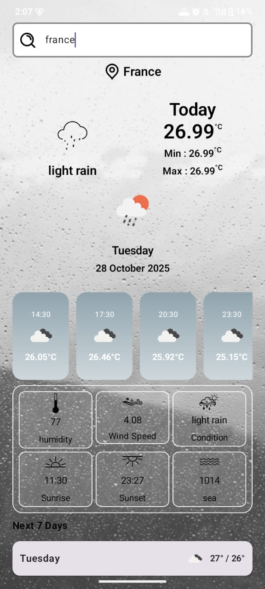
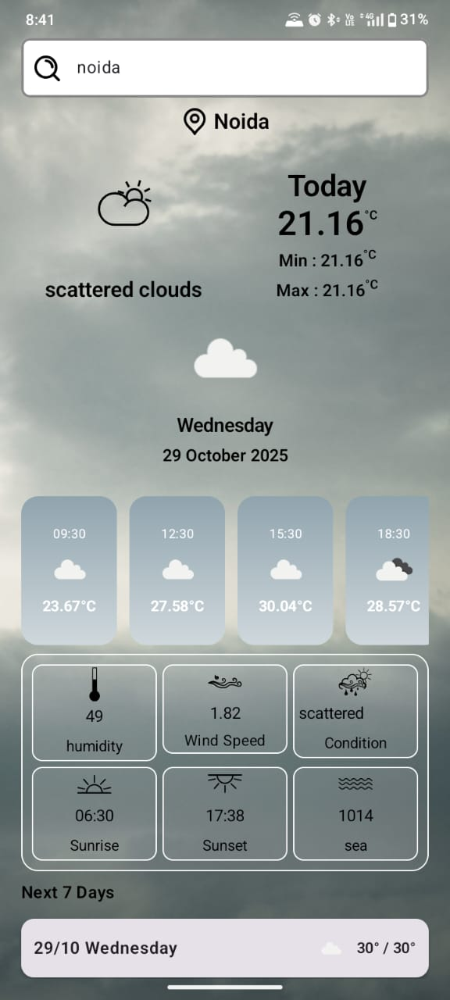

# WeatherApp: A Beginner's Guide

Welcome to the WeatherApp! This document explains everything you need to know about this project, from what it does to how it's built. It's written to be understood by everyone, whether you're a seasoned developer or just curious about how apps are made.

## What Does This App Do? (Features)

This is a simple weather application for Android phones. It allows you to:

*   **See a Weather Report:** Check the current weather conditions for your exact location.
*   **Look into the Future:** Get a 5-day weather forecast to plan your week.
*   **Explore Weather Elsewhere:** Search for the weather in any city around the world.

---

## Screenshots

*(Here you can add some screenshots of the application. You can take a screenshot of the running app in the Android Studio emulator by clicking the camera icon in the emulator's side panel. Once you have the screenshots, create a `screenshots` folder in the root of the project and add the images there.)*

|                  Current Weather                  |                  5-Day Forecast                   |
|:-------------------------------------------------:|:-------------------------------------------------:|
|  |  |

---

## Getting the App to Work

To get the app from its source code to a working application on a phone, you'll need a few things.

### The Secret Key for Weather Data (API Key)

This app gets its weather information from a service called **OpenWeatherMap**. Think of it as a massive weather data library. To access this library, our app needs a library card, which in the programming world is called an **API Key**.

An **API (Application Programming Interface)** is just a set of rules that lets different computer programs talk to each other. The API Key is a unique password that proves our app has permission to ask OpenWeatherMap for weather data.

You'll need to get your own free API key:

1.  Go to the [OpenWeatherMap website](https://openweathermap.org/api) and sign up.
2.  Find your unique API key on your account page.
3.  In this project's code, find the file located at `app/src/main/java/com/example/weatherapp/core/data/repository/WeatherRepositoryImpl.kt`.
4.  Inside this file, you'll see a line with `appid = "YOUR_API_KEY"`. Replace `"YOUR_API_KEY"` with the key you got from the website.

### Building and Running the App

"Building" is the process of turning the human-readable code into a single file (`.apk` or `.aab`) that an Android phone can understand and run.

1.  **Get the Code:** First, you need a copy of the project on your computer. If you have Git installed, you can "clone" the repository with this command: `git clone https://github.com/your-username/WeatherApp.git`.
2.  **Open in Android Studio:** **Android Studio** is the official program for creating Android apps, provided by Google. It has all the tools you need to write, build, and test your code. Open the project folder you just downloaded.
3.  **Add Your API Key:** Follow the steps in the "API Key" section above.
4.  **Secure Your App (Keystore):** When developers release apps to the public, they digitally "sign" them to prove they are the true author and that the app hasn't been tampered with. This signature is kept in a secure file called a **Keystore**. For this project, you need to create a `keystore.properties` file in the main project folder with the following placeholder content (you can use any passwords for development):
    ```properties
    storePassword=your_store_password
    keyAlias=your_key_alias
    keyPassword=your_key_password
    storeFile=path/to/your/keystore.jks
    ```
5.  **Run It!:** In Android Studio, you can now press the "Run" button. This will build the app and install it on either a connected Android phone or a simulated phone on your computer (an "emulator").

---

## Documentation

The code in this project is documented using **KDoc**, the official documentation style for the Kotlin language. These comments are written directly in the code to explain what each part does.

### Viewing Documentation

You can easily view the documentation for any piece of code directly in Android Studio. Simply hover your mouse cursor over a class, function, or variable name, and a tooltip will appear with its documentation.

### Generating a Documentation Website

For a more comprehensive view, you can generate a full HTML documentation website using a tool called **Dokka**. This website will contain all the KDoc comments in a browsable format.

**To generate the documentation:**

1.  Make sure you have the Dokka plugin added to your `build.gradle.kts` file. If not, you will need to add it.
2.  Open the Gradle tool window in Android Studio (usually on the right side).
3.  Navigate to `WeatherApp -> Tasks -> documentation`.
4.  Run the `dokkaHtml` task.

This will generate a `dokka` folder in your project's `build` directory. Open the `index.html` file inside this folder in a web browser to view the full documentation website.

---

## How to Use the App

*   **Current Weather:** When you first open the app, it will ask for permission to see your device's location. This is so it can automatically show you the weather right where you are.
*   **5-Day Forecast:** On the main screen, right below the current weather, you'll find the forecast for the next five days.
*   **Search for a City:** Look for a search icon (a magnifying glass) at the top of the screen. Tap it and type the name of any city to see its weather.

---

## The Building Blocks (Technologies, Languages, and Libraries)

An app is made of many parts. Here's what this app is built with:

*   **Kotlin:** This is the programming language used to write the app's logic. Think of it as the grammar and vocabulary the developers use to give instructions to the phone. It's the modern, official language for Android development.
*   **Jetpack Compose:** This is a modern toolkit for building the app's **User Interface (UI)**—everything you see and interact with, like buttons, text, and images. Instead of manually designing screens, developers describe what the UI *should* look like in code, and Compose builds it. It's like giving an artist a description of a painting instead of painting it yourself.
*   **Coroutines:** Imagine you ask a friend to make you a coffee. Instead of standing there and waiting, you go and sit down to read a book. When the coffee is ready, your friend brings it to you. Coroutines let the app do the same thing: it can make a "long" request (like fetching weather data from the internet) in the background without freezing the app. This is called **asynchronous programming**.
*   **Hilt (Dependency Injection):** Imagine you're building a car. You need an engine, wheels, and a steering wheel. Instead of building each of these parts yourself every time, you have a supplier who provides them to you whenever you need them. Hilt does this for the app. It automatically provides different parts ("dependencies") of the app to each other, making the code cleaner and easier to manage.
*   **Retrofit:** This is a library that makes it very easy for the app to "talk" to the OpenWeatherMap servers over the internet. It handles the complicated parts of making network requests.
*   **Moshi:** When the app gets data from the weather server, it comes in a format called **JSON**. This is a text format that's easy for computers to read but isn't directly usable by our app's Kotlin code. Moshi is a "translator" that converts this JSON data into Kotlin objects that our app can easily work with.
*   **Coil:** A specialized library for downloading images from the internet (like weather icons) and displaying them efficiently.
*   **Lottie:** A fun library for displaying beautiful, high-quality animations, making the app feel more alive.
*   **Accompanist:** A helper library that provides extra features for Jetpack Compose, like making it easier to ask for permissions (e.g., location access).

---

## The App's Blueprint (Architecture)

An app's architecture is its fundamental design. It's like the blueprint for a house, ensuring everything is organized and works well together. This app uses a "layered" architecture, which is a common and highly recommended approach. Think of it like a restaurant:

*   **UI Layer (The Dining Area & Waitstaff):** This is what you, the user, interact with. It includes all the screens and buttons. Like a waiter, it takes your requests (e.g., searching for a city) and presents you with the final result (the weather data, beautifully displayed).
*   **Domain Layer (The Head Chef):** This layer contains the core business logic. The chef doesn't talk to the customers or go to the market. They take the order from the waiter, decide how to cook the dish (e.g., "get current weather for this location"), and tell the kitchen staff what ingredients to get. This layer connects the UI to the data.
*   **Data Layer (The Kitchen & Pantry):** This layer is responsible for getting the raw data. It might get data from a local database (the pantry) or from an external source like the internet (the market). In our app, this layer uses Retrofit to fetch data from the OpenWeatherMap API.

This separation makes the app easier to test, maintain, and expand in the future.

---

## A Tour of the Project Files (File Breakdown)

Here's a map of the most important files and folders in the project:

### Project Structure

```
.
├── app
│   ├── build.gradle.kts      // Instructions for building the app
│   ├── src
│   │   ├── main
│   │   │   ├── java
│   │   │   │   └── com/example/weatherapp
│   │   │   │       ├── di              // Dependency Injection setup (currently empty)
│   │   │   │       ├── ui              // UI-related code (the "look" of the app)
│   │   │   │       │   └── theme       // Colors, fonts, and styles
│   │   │   │       ├── core            // The core logic and data handling
│   │   │   │       │   ├── data
│   │   │   │       │   │   └── repository
│   │   │   │       │   │       └── WeatherRepositoryImpl.kt // Implements data fetching
│   │   │   │       │   ├── domain      // Business logic interfaces
│   │   │   │       │   └── viewModel.kt  // Prepares data for the UI
│   │   │   │       ├── data
│   │   │   │       │   └── ApiInterface.kt // Defines the API requests
│   │   │   │       └── weather
│   │   │   │           └── MainActivity.kt // The main entry point of the app
│   │   │   ├── res                   // Resources: images, icons, layout files
│   │   │   └── AndroidManifest.xml   // The app's "ID card"
...
```

### Key Files and Their Roles

*   `app/build.gradle.kts`: A script that tells Android Studio which libraries to include and how to build the app.
*   `app/src/main/AndroidManifest.xml`: The "ID card" for the app. It tells the Android operating system what the app is called, what its icon is, what permissions it needs (like location), and what screens it has.
*   `app/src/main/java/.../MainActivity.kt`: This is the first door you walk through when you open the app. It's the main screen that gets loaded.
*   `app/src/main/java/.../ApiInterface.kt`: Defines the exact commands (like `getWeatherData`) that Retrofit can use to talk to the OpenWeatherMap API.
*   `app/src/main/java/.../WeatherRepositoryImpl.kt`: This is where the app actually fetches the data. It takes requests from the `ViewModel` and uses the `ApiInterface` to get the data from the internet.
*   `app/src/main/java/.../viewModel.kt`: Acts as a middle-man between the data (`Repository`) and the UI. It holds the data and gets it ready for the UI to display, so the data survives screen rotations and other configuration changes.
*   `app/src/main/java/.../ui/theme/`: This folder contains files that define the app's visual style: `Color.kt` for the color palette, `Type.kt` for the fonts and text styles, and `Theme.kt` to put it all together.
